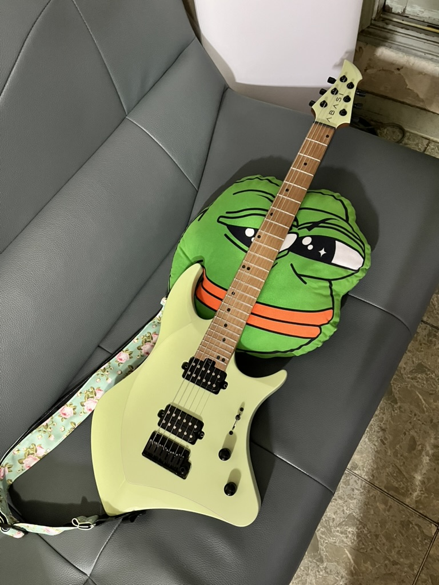
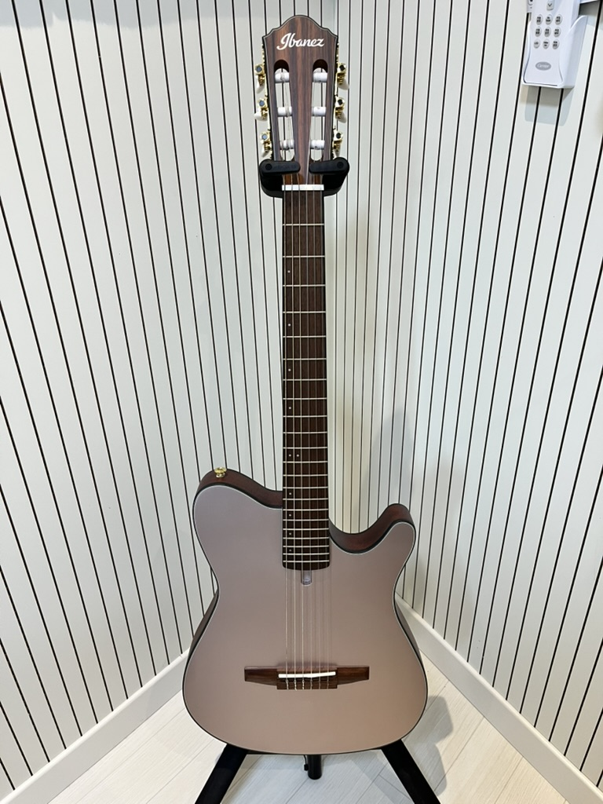
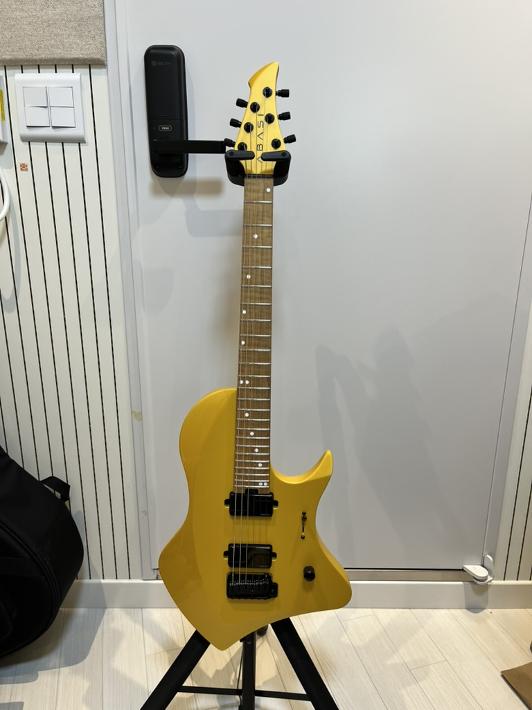
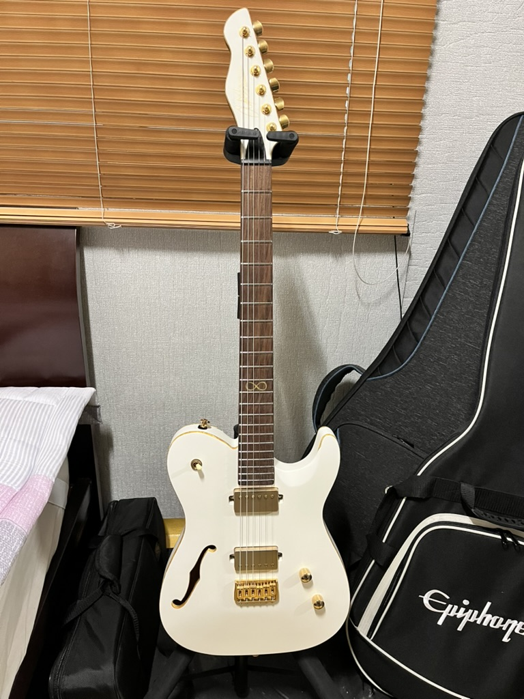

# JD

공사중... 내용을 뭐로 채울까?? 🤔🤔🤔  

iOS Developer by day, Guitarist by night. 🎸  
Exploring the world of DSP and Audio Engineering to build the ultimate guitar effect plugins.  
Forget about me, the guitars are the real stars here.

## My Guitars

<table align="center">
  <tr>
    <td align="center">
      <b>Main Guitar, Rona</b> 
      
    </td>
    <td align="center">
      <b>PingPing</b> 
      
    </td>
  </tr>
  <tr>
    <td align="center">
      <b>Nana</b> 
      
    </td>
    <td align="center">
      <b>GolGol</b> 
      
    </td>
  </tr>
</table>

## 🛠 Tech Stack
 

---

## 🔭 Currently Working On
- 🎵 **[JDTuner]**: A high-precision guitar tuner using C++ and SwiftUI.
- 🎛 **[GelFuzz]**: Developing a easy OctaFuzz effect Plugin.

---